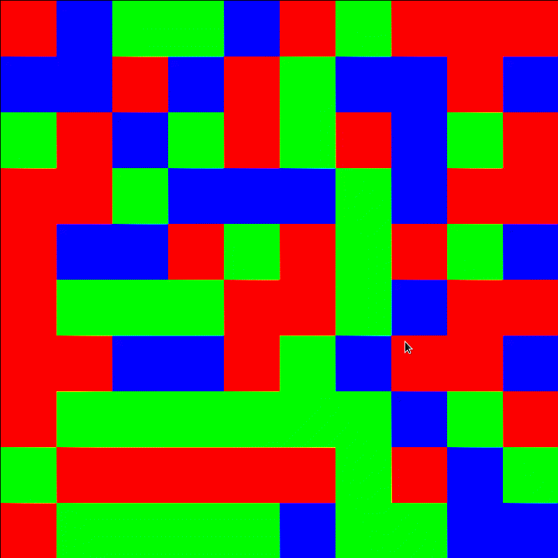

# Procedural terrain generation

Here I will put procedural terrain generation experiments

### Fluid inspired terrain generation
The thought here is to make the terrain cells behave as particles, and do a Monte-Carlo-inspired simulation, thinking that the particles will create different phases. However, this does not work properly yet, as can be seen in the animation below. 

The terain cell "moves" a randomly chosen direction if that results in having a higher number of neighbours of the same type. This I will change to calculating some kind of energy. The interaction energy between equal terrain will be low, and interaction energy between unequal terrain will be high. Each step in the simulation will then only be accepted if the energy change is negative, or if the increase is sufficiently low. 

